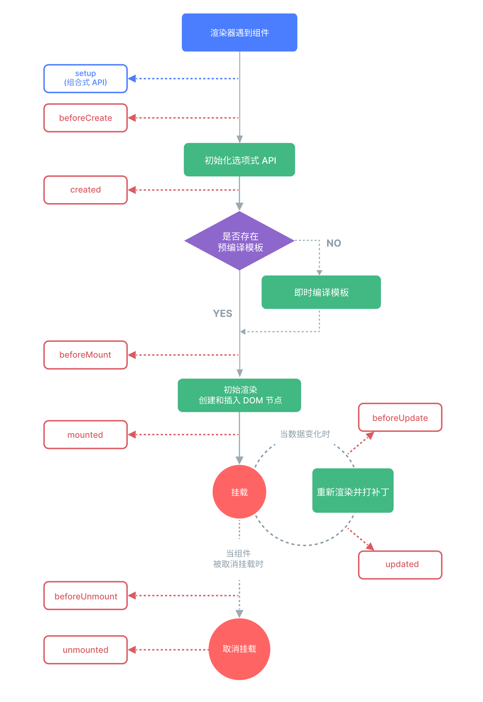

# Vue

UI框架 声明式、组件化编程模型

- 声明式渲染 Vue 基于标准 HTML 拓展了一套模板语法，可以声明式地描述最终输出的 HTML 和 JavaScript 状态之间的关系。
- 响应式 Vue 会自动跟踪 JavaScript 状态并在其发生变化时响应式地更新 DOM。

SFC 将一个组件的逻辑 (JavaScript)，模板 (HTML) 和样式 (CSS) 封装在同一个文件里

## 构建工具

create-vue

```bash
pnpm create vue@latest
```

- 全局构建版 在全局对象上通过Vue对象暴露API
- ES模块版 可以使用import maps来简化模块路径


## API

```javascript
app = createApp(RootComponent, rootProp?);
app.component("name", Component); // 挂载应用级组件
app.directive()
app.use() // 注册插件
app.provider()
app.runWithContext(fn)
app.config; // 属性对象上配置一些应用级的选项
app.config.errorHandler // 全局错误处理函数
app.config.globalProperties // 全局属性
app.config.optionMergeStrategies // 对不同来源的选项进行合并
app.mount(dom | selector); // 返回值是根组件实例而非应用实例
```

选项式vs组合式

用包含多个选项的对象来描述组件的逻辑，选项所定义的属性都会暴露在函数内部的 this 上，它会指向当前的组件实例。

导入的 API 函数来描述组件逻辑

只是同一个底层系统所提供的两套不同的接口，`选项式 API 是在组合式 API 的基础上实现的`。

render > template > DOM Template

应用根组件的内容将会被渲染在容器元素里面。容器元素自己将不会被视为应用的一部分。

当根组件没有设置 template 选项时，Vue 将自动使用容器的 innerHTML 作为模板。

## 模版语法

在底层机制中，Vue 会将模板编译成高度优化的 JavaScript 代码。结合响应式系统，当应用状态变更时，Vue 能够智能地推导出需要重新渲染的组件的最少数量，并应用最少的 DOM 操作。

1. 文本插值 {{}}

2. 原始 HTML `v-html` 在当前组件实例上，将此元素的 innerHTML 与 rawHtml 属性保持同步。
   不能使用 v-html 来拼接组合模板
3. 属性绑定 v-bind:attribute=expression
   如果绑定值是 null 或者 undefined，那么该 attribute 将会从渲染的元素上移除。
   布尔型 Attribute 其为其他假值时 attribute 将被忽略,为真或`''`时保留。
   动态绑定多个值 `不带参数的 v-bind` 绑定 属性及属性值的映射对象

   Vue 所有的数据绑定中都支持完整的 JavaScript 表达式，并以`当前组件实例为作用域解析执行`。
   在 Vue 模板内，JavaScript 表达式可以被使用在如下场景上：

   - 在`文本插值`中 (双大括号)
   - 在任何 `Vue 指令 attribute 的值`中

受限的全局访问:

- 模板中的表达式将被沙盒化，仅能够访问到有限的全局对象列表。该列表中会暴露常用的内置全局对象，比如 Math 和 Date。
- 没有显式包含在列表中的全局对象将不能在模板内表达式中访问，例如用户附加在 window 上的属性。然而，你也可以自行在 app.config.globalProperties 上显式地添加它们，供所有的 Vue 表达式使用。

## 指令

指令 attribute 的期望值为一个 JavaScript 表达式 (除了少数几个例外，即 v-for、v-on 和 v-slot)。
指令的任务是在其表达式的值变化时`响应式地更新 DOM`。

动态参数 :[param] 参数会作为一个 JavaScript 表达式被动态执行，计算得到的值会被用作最终的参数。

动态参数值的限制
动态参数中表达式的值应当是一个`字符串`，或者是 `null`。特殊值 null 意为显式移除该绑定。其他非字符串的值会触发警告。

动态参数语法的限制
动态参数表达式因为某些字符的缘故有一些语法限制，比如`空格和引号`，在 HTML attribute 名称中都是不合法的。
当使用 DOM 内嵌模板 (直接写在 HTML 文件里的模板) 时，我们需要`避免在名称中使用大写字母`。单文件组件内的模板不受此限制。

修饰符
修饰符是以点开头的特殊后缀，表明指令需要以一些特殊的方式被绑定。

## 计算属性

描述依赖响应式状态的复杂逻辑,声明性地计算和缓存衍生值
计算属性会自动追踪响应式依赖，其值会基于`响应式依赖被缓存`，仅会在响应式依赖更新时才重新计算，而方法调用总是会在`重渲染发生时再次执行函数`。
​​计算属性`默认只读`。可同时提供getter和setter来创建可写计算属性。
计算属性ref在模板中会自动解包。

最佳实践

- getter不应有副作用 计算属性的 getter 应`只做计算而没有任何其他的副作用`(如不要在 getter中改变其他状态、做异步请求或者更改 DOM)，一个计算属性的声明中描述的是如何根据其他值派生一个值。getter 的职责应该仅为计算和返回派生值。
- 避免直接修改计算属性值 应该更新它所依赖的源状态以触发新的计算

## Class和Style绑定

class绑定支持字符串、对象和数组

应用在组件上的属性，会自动透传到组件的根元素上(只有一个根节点)并与该元素上已有的class合并,对于多个根元素组件，需要通过`$attrs.class`在接受的节点上再绑定。

style绑定支持对象、对象数组
支持camelCase和kebab-cased形式的属性
Vue在运行时检查该属性是否支持在当前浏览器中使用自动加前缀。
`样式多值`:一个样式属性提供多个(不同前缀的)值
使用数组提供可选值，仅会渲染浏览器支持的最后一个值。

## 响应式

响应性 声明式地处理变化的编程范式

在 JavaScript 中有两种劫持 property 访问的方式：getter / setters 和 Proxies。
Vue 2 使用 getter / setters 完全是出于支持旧版本浏览器的限制。而在 Vue 3 中则使用了 Proxy 来创建响应式对象，仅将 getter / setter 用于 ref。
Vue 的响应性系统是通过深度转换普通 JavaScript 对象为响应式代理来实现的

状态机是一种数据模型，用于描述应用可能处于的所有可能状态，以及从一种状态转换到另一种状态的所有可能方式。

reactive()
Vue 能够跟踪对响应式对象属性的访问与更改操作。

`<script setup>`避免在 setup() 函数中手动暴露大量的状态和方法。
`<script setup>` 中的顶层的导入和变量声明可在同一组件的模板中直接使用。模板中的表达式和 `<script setup>`中的代码处在同一个作用域中。

DOM 更新时机(异步更新)
当你更改响应式状态后，DOM 会自动更新。然而，DOM 的更新并不是同步的。相反，Vue 将缓冲它们直到更新周期的 “下个时机” 以确保无论你进行了多少次状态更改，每个组件都只更新一次。
若要等待一个状态改变后的 DOM 更新完成，可以使用 nextTick()。

深层响应性

在 Vue 中，状态都是默认深层响应式的。

只有代理对象是响应式的，更改原始对象不会触发更新。
对同一个原始对象调用 reactive() 会总是返回同样的代理对象，而对一个已存在的代理对象调用 reactive() 会返回其本身。

响应式对象内的嵌套对象依然是代理。

reactive()的限制：

- 只能用于对象类型,对原始类型无效;
- 不能替换整个对象;(Vue的响应式跟踪是通过对属性访问实现的，需要始终保持对响应式对象的相同引用)
- 解构操作可能丢失响应性。(原始类型值的属性)

ref() 可以创建任意类型的响应式ref对象
ref的`.value`属性也是响应式的。同时，当值为对象类型时，会用 reactive() 自动转换它的 .value。

Ref对象具有深层响应性，可以通过shallow ref来放弃深层响应性。对于浅层 ref，只有 .value 的访问会被追踪。

一个包含对象类型值的 ref 可以响应式地替换整个对象。
ref对象传递给函数或进行解构不会丢失响应性。

- ref在模板中作为顶层属性被访问时会被自动解包。
- ref在响应式对象中的解包
当一个ref被嵌套在一个响应式对象中，作为属性被访问或更改时会自动解包，跟一般的属性一样。
将一个新的ref赋值给一个关联了已有ref的属性，旧的ref会被替换掉。

只有当嵌套在一个深层响应式对象内时，才会发生 ref 解包。当其作为浅层响应式对象的属性被访问时不会解包。

ref解包细节：

- 作为reactive对象的属性: 一个 ref 会在作为响应式对象的属性被访问或修改时自动解包
- 数组和集合的注意事项: 当ref作为响应式数组或原生集合类型中的元素被访问时不会被解包。
- 在模板中解包的注意事项: 在模板渲染上下文中，只有顶级的 ref 属性才会被解包。但如果 ref 是文本插值的最终计算值会将被解包(仅作为文本插值的便利特性)。

## 条件渲染

- v-if
- v-else-if
- v-else
- v-show

v-if/v-else-if/v-else可以在`<template>`上使用。

一个v-else元素必须跟在一个v-if或者v-else-if元素后面。
一个v-else-if的元素必须紧跟在一个v-if或一个v-else-if元素后面。

当 v-if 和 v-for 同时存在于一个元素上的时候，v-if 会首先被执行。v-if 的条件将无法访问到 v-for 作用域内定义的变量。

v-show 会在 DOM 渲染中保留该元素；v-show 仅切换了该元素上名为 display 的 CSS 属性。
v-show 不支持在 `<template>` 元素上使用，也不能和 v-else 搭配使用。

v-if 与 v-show 的区别

- v-if 真实的条件渲染，能确保条件区块内的事件监听器和子组件都会被销毁与重建。并且渲染是惰性的。
- v-show 不支持在 `<template>` 元素上使用，也不能和 v-else 搭配使用。
- v-show 无论初始条件如何，始终会被渲染，只是切换了display属性值。
- v-if 有更高的切换开销，而 v-show 有更高的初始渲染开销。

## 列表渲染

v-for 可以遍历数组和对象，甚至范围(整数值) [1...n]； 支持 in 或 of 分隔；可以用在 `<template>` 标签上使用 v-for 来渲染一个包含多个元素的块。

通过key`管理状态`

Vue 默认按照“就地更新”的策略来更新通过 v-for 渲染的元素列表。当数据项的顺序改变时，Vue 不会随之移动 DOM 元素的顺序，而是就地更新每个元素，确保它们在原本指定的索引位置上渲染。

默认模式是高效的，但`只适用于列表渲染输出的结果不依赖子组件状态或者临时 DOM 状态` (例如表单输入值) 的情况。

为了给 Vue 一个提示，以便它可以`跟踪每个节点的标识`，从而`重用和重新排序现有的元素`，需要为每个元素对应的块提供一个`唯一`的 key。

在任何可行的时候为 v-for 提供一个 key attribute，除非所迭代的 DOM 内容非常简单 (例如：不包含`组件`或`有状态的 DOM 元素`)，或者你想有意采用默认行为来提高性能。

key 绑定的值期望是一个基础类型的值，例如字符串或 number 类型。不要用对象作为 v-for 的 key。

数组变化侦测

变更方法
Vue 能够侦听响应式数组的变更方法，并在它们被调用时触发相关的更新。

- push()
- pop()
- shift()
- unshift()
- splice()
- sort()
- reverse()

替换数组
当遇到的是非变更方法时，需要将旧的数组替换为新的。Vue实现了一些巧妙的方法来最大化对 DOM 元素的重用。

## 事件处理

事件处理器的值

- 内联 $event
- 方法

方法事件处理器会自动接收原生 DOM 事件并触发执行

模板编译器会通过检查 v-on 的值是否是合法的 JavaScript 标识符或属性访问路径来断定是何种形式的事件处理器。

事件修饰符

- prevent 阻止默认行为
- stop 阻止继续冒泡
- capture 在被内部元素处理前，先被外部处理
- self 仅当 event.target 是元素本身时才会触发事件处理器
- once 最多被触发一次
- passive 不阻止事件的默认行为 滚动事件的默认行为 (scrolling) 将立即发生而非等待 `onScroll` 完成 一般用于触摸事件的监听器，可以用来改善移动端设备的滚屏性能

使用多个事件修饰符时需要注意顺序。

按键修饰符 检查特定的按键 需要使用kebab-case 形式。

按键别名

- enter
- page-dwon
- delete
- esc
- space
- left
- right
- up
- down

系统按键修饰符 只有当按键被按下时才会触发

- ctrl
- shift
- alt
- meta
- exact 修饰符允许控制触发一个事件所需的确定组合的系统按键修饰符。

鼠标按键修饰符 特定鼠标按键触发的事件

- left
- right
- middle

.exact 修饰符 精确控制触发事件所需的系统修饰符的组合

## 表单输入绑定

v-model 根据所使用的元素自动使用对应的 DOM 属性和事件组合

- 文本类型的 `<input>` 和 `<textarea>` 元素会绑定 `value` property 并侦听 `input` 事件；
- `<input type="checkbox">` 和 `<input type="radio">` 会绑定 `checked` property 并侦听 `change` 事件；
- `<select>` 会绑定 `value` property 并侦听 `change` 事件。
- v-model 会忽略任何表单元素上初始的 value、checked 或 selected attribute

在 `<textarea>` 中是不支持插值表达式的

true-value 和 false-value 是 Vue 特有的 attributes，仅支持和 v-model 配套使用。

修饰符

- lazy 默认情况下，v-model 会在每次 input 事件后更新数据。可以添加 lazy 修饰符来改为在每次 change 事件后更新数据。
- number 通过 parseFloat 自动转换为数字,如果失败返回原始值。number 修饰符会在输入框有 type="number" 时自动启用。
- trim 去除两端空格

自定义组件上也支持 v-model。

## 生命周期

每个 Vue 组件实例在创建时都需要经历一系列的初始化步骤，比如设置好数据侦听，编译模板，挂载实例到 DOM，以及在数据改变时更新 DOM。

onMounted 钩子可以用来在组件完成初始渲染并创建 DOM 节点后运行代码。

同步注册


## 侦听器

状态发生变化时执行一些副作用或根据异步操作结果修改状态等
每次响应式状态发生变化时触发回调函数

watch(attribute, callback)
侦听数据源：

- ref (包括计算属性)
- 响应式对象
- getter 函数
- 多个数据源组成的数组

`不能直接侦听响应式对象的属性值`,需要使用 getter 函数。

深层侦听器
直接给 watch() 传入一个响应式对象，会隐式地创建一个深层侦听器。

显式地加上 deep 选项，强制转成深层侦听器

watch 默认是懒执行的：仅当数据源变化时，才会执行回调。当希望在创建侦听器时，立即执行一遍回调时，传入 immediate: true 选项来强制侦听器的回调立即执行。

每当被侦听源发生变化时，侦听器的回调就会执行。当希望回调只在源变化时触发一次，可以使用 once: true 选项

watchEffect() 自动跟踪回调的响应式依赖，消除手动维护依赖列表的负担。回调会立即执行，不需要指定 immediate: true。

watch vs. watchEffect 追踪响应式依赖的方式

- watch 只追踪明确侦听的数据源。不会追踪任何在回调中访问到的东西。另外，仅在数据源确实改变时才会触发回调。watch 会避免在发生副作用时追踪依赖，能更加精确地控制回调函数的触发时机。

- watchEffect，则会在副作用发生期间追踪依赖。它会在同步执行过程中，自动追踪所有能访问到的响应式属性。这更方便，而且代码往往更简洁，但有时其响应性依赖关系会不那么明确。
- 需要侦听一个嵌套数据结构中的几个属性，watchEffect() 可能会比深度侦听器更有效，因为它将只跟踪回调中被使用到的属性，而不是递归地跟踪所有的属性。
- watchEffect 仅会在其`同步执行期间`，才追踪依赖。在使用异步回调时，只有在第一个 await 正常工作前访问到的属性才会被追踪。

回调的触发时机
当你更改了响应式状态，它可能会同时触发 Vue 组件更新和侦听器回调。
类似于组件更新，用户创建的侦听器回调函数也会被批量处理以避免重复调用。

默认情况下，用户创建的侦听器回调，都会在`父组件更新 (如有) 之后、所属组件的 DOM 更新之前`被调用。因此在侦听器回调中访问的所属组件的DOM，将处于更新之前的状态。

如果想在侦听器回调中能访问被Vue更新之后的组件所属DOM，需要指明 flush: 'post' 选项。

watchPostEffect() 后置刷新

同步侦听
在 Vue 进行任何更新之前触发 使用flush: "sync"选项 watchSyncEffect()
同步侦听器`不会进行批处理`，每当检测到响应式数据发生变化时就会触发。可以使用它来监视简单的布尔值，但应避免在可能多次同步修改的数据源 (如数组) 上使用。

停止侦听器

在 setup() 或 `<script setup>` 中用同步语句创建的侦听器，会自动绑定到宿主组件实例上，并且会在宿主组件卸载时自动停止。
侦听器必须用`同步语句创建`。如果用异步回调创建一个侦听器，那么它不会绑定到当前组件上，必须手动停止它，以防内存泄漏。
要手动停止一个侦听器，请调用 watch 或 watchEffect 返回的函数。

## 模版引用

ref 允许我们在一个特定的 DOM 元素或子组件实例`被挂载后`，获得对它的直接引用。
只可以在组件挂载后才能访问模板引用。
当在 v-for 中使用模板引用时，对应的 ref 中包含的值是一个数组，它将在元素被挂载后包含对应整个列表的所有元素。但ref 数组并不保证与源数组相同的顺序。

函数模板引用(回调 Ref)
会在`每次组件更新时都被调用`。该函数会收到元素引用作为其第一个参数。
需要使用动态的 :ref 绑定才能够传入一个函数。当绑定的元素被卸载时，函数也会被调用一次，此时的 el 参数会是 null。

模板引用也可以被用在一个子组件上。这时引用中获得的值是组件实例。
如果一个子组件使用的是选项式 API 或没有使用 `<script setup>`，被引用的组件实例和该子组件的 this 完全一致。此时父组件对子组件的每一个属性和方法都有完全的访问权。
有一个例外的情况，使用了 `<script setup>` 的组件是默认私有的：一个父组件无法访问到一个使用了 `<script setup>` 的子组件中的任何东西，除非子组件在其中通过 defineExpose 宏显式暴露。

## 组件

在每个组件内封装自定义内容与逻辑。
通过`<script setup>`定义的组件将会以默认导出的形式被暴露给外部，导入的组件都在模板中直接可用。
在单文件组件中，推荐为子组件使用 PascalCase 的标签名，也可以使用 /> 来关闭一个标签。
如果直接在 DOM 中书写模板 (例如原生`<template>` 元素的内容)，模板的编译需要遵从浏览器中 HTML 的解析行为,应该使用 kebab-case 形式并显式地关闭这些组件的标签。

传递props

defindProps()
defineProps 是一个仅 `<script setup>` 中可用的编译宏命令，并不需要显式地导入。声明的 props 会自动暴露给模板。defineProps 会返回一个对象，其中包含了可以传递给组件的所有 props。
如果没有使用`<script setup>`，props 必须以 props 选项的方式声明，props 对象会作为 setup() 函数的第一个参数被传入。

defineEmits()
defineEmits 仅可用于 `<script setup>`之中，并且不需要导入，它返回一个等同于 $emit 方法的 emit 函数。

在没有使用 `<script setup>`的组件上可以通过 emits 选项定义组件会抛出的事件。可以从 setup() 函数的第二个参数，即 setup 上下文对象上访问到 emit 函数。

子组件可以通过调用内置的 $emit 方法，通过传入事件名称来抛出一个事件。

通过插槽来分配内容 (向组件传递内容)
可以在组件内部通过Vue的自定义 <slot> 元素来实现

动态组件
通过Vue的 `<component>`元素和特殊的 `is` attribute 实现。is的取值可以是被注册的组件名或导入的组件对象。
当使用 `<component :is="...">` 来在多个组件间作切换时，被切换掉的组件会被卸载。可以通过 `<KeepAlive>` 组件强制被切换掉的组件仍然保持“存活”的状态。

DOM 模板解析的所有注意事项

- 不区分大小写
- 必须显式地写出关闭标签
- 元素位置限制 某些 HTML 元素对于放在其中的元素类型有限制 可以使用特殊的 is attribute 作为一种解决方案。当使用在原生 HTML 元素上时，is 的值必须加上前缀 vue: 才可以被解析为一个 Vue 组件。

注意:
以下情况无DOM模版限制

- 单文件组件
- 内联模板字符串 (例如 template: '...')
- `<script type="text/x-template">`

## 组件注册

全局组册
使用 component()方法将组件注册在应用上，应用的所有组件上不用再注册就可以使用。全局注册会使 TreeShaking 优化失效，组件间的依赖关系不明显,会让代码的可维护性变差。

局部注册
使用`<script setup>`的 SFC,导入之后就可直接使用，无需手动注册；不使用的还需要使用 components 属性进行注册。相对全局注册，组件间的依赖关系明确，支持 Tree shaking 优化。
局部注册的组件在后代组件中并不可用。

### props

- defineProps()
- props选项

props 只读, 不应该在组件中修改

静态vs动态props
静态props只能传递字符串和布尔类型的值，动态props需要使用v-bind,可以传递任意类型的值，还可以使用对象绑定多个prop。

单向数据流
父组件的更新而变化，自然地将新的状态向下流往子组件，而不会逆向传递，避免了子组件意外修改父组件的状态的情况

prop校验

- type
- required
- default(rawProps)
- validator(value, props)

注意事项：

- 所有 prop 默认都是可选，除非声明了 required: true
- 除 Boolean 外的未传递的可选 prop 将会有一个默认值 undefined
- Boolean 类型的未传递 prop 将被转换为 false，但可以通过为它设置 default 来更改
- 如果声明了 default 值，那么在 prop 的值被解析为 undefined 时，无论 prop 是未被传递还是显式指明的 undefined，都会改为 default 值。
- 当一个 prop 被声明为允许多种类型时，Boolean 的转换规则也将被应用。然而，当同时允许 String 和 Boolean 时，有一种边缘情况——只有当 Boolean 出现在 String 之前时，Boolean 转换规则才适用。

使用 watch()监听 reactive 对象时第一个参数要传一个函数，不传函数监听会失效
Ref 对象可以直接监听

### 事件

- $emit()
- defineEmits()

`组件触发的事件没有冒泡机制`,只能监听直接子组件触发的事件。平级组件或是跨越多层嵌套的组件间通信，应使用一个外部的事件总线，或是使用一个全局状态管理方案。
所有传入 $emit() 的额外参数都会被直接传向监听器
如果一个原生事件的名字 (例如 click) 被定义在 emits 选项中，则监听器只会监听组件触发的 click 事件而不会再响应原生的 click 事件

## 组件v-modal

defineModel() 返回的值是一个 ref, 它的 .value 和父组件的 v-model 的值同步。
编译器展开:

- 一个名为 modelValue 的 prop，本地 ref 的值与其同步；
- 一个名为 update:modelValue 的事件，当本地 ref 的值发生变更时触发。

## 透传attribute

“透传 attribute”指的是传递给一个组件，却没有被该组件声明为 props 或 emits 的 attribute 或者 v-on 事件监听器。

当一个组件以单个元素为根作渲染时，透传的 attribute 会自动被添加到根元素上。
如果一个子组件的根元素已经有了 `class` 或 `style` attribute，它会和从父组件上继承的值合并。(class和style属性值合并)

组件和组件内部根元素绑定了同名的事件，则这两个同名的监听器都会被触发。（v-on 监听器继承）

有些情况下一个组件会在根节点上渲染另一个组件,透传的 attribute 不会包含中间组件上声明过的 props 或是针对 emits 声明事件的 v-on 侦听函数。透传的 attribute 若符合声明，也可以作为 props 传入子组件。(深层透传)

禁用 Attributes 继承

- 选项属性 inheritAttrs: false
- defineOptions
- useAttrs()

在模版中透传属性通过 `$attrs`获取

透传属性与prop的区别：

- 透传 attributes 在 JavaScript 中保留了它们原始的大小写
- 事件监听器将在此对象下被暴露为一个函数

非根节点的attributes透传可以通过设定 `inheritAttrs: false` 和使用 `v-bind="$attrs"` 来实现
多个根节点的组件没有自动 attribute 透传行为。
attrs 对象总是反映为最新的透传 attribute，但它并不是响应式的，`不能通过侦听器去监听它的变化`。

## 插槽

在某些场景中为子组件传递一些模板片段，让子组件在它们的组件中渲染这些片段。

`<slot>` 元素是一个插槽出口 (slot outlet)，标示了父元素提供的插槽内容 (slot content) 将在子组件中哪里被渲染。 父组件提供渲染内容，子组件负责渲染。

`插槽内容无法访问子组件的数据`。Vue 模板中的表达式只能访问其定义时所处的作用域，这和 JavaScript 的词法作用域规则是一致的。即父组件模板中的表达式只能访问父组件的作用域；子组件模板中的表达式只能访问子组件的作用域。
`v-slot:slotName` 指令只能用在`<template>`中。
v-slot: => `#`

默认内容 子组件提供在<slot></slot>元素之间,仅在父组件使用了子组件并且没有提供任何插槽内容时使用默认内容。

具名插槽 使用<slot></slot>元素的`name`属性为插槽分配唯一的ID,在父组件通过在<template>元素上使用`v-slot`或`#`指定插槽名。

没有提供 name 的 <slot> 出口会隐式地命名为“default”。

当一个组件同时接收默认插槽和具名插槽时，所有位于顶级的非 <template> 节点都被隐式地视为默认插槽的内容。

`<slot/>` 不支持指令

根据插槽是否存在来渲染某些内容,可以结合使用 $slots 属性与 v-if 来实现,但需要在在<slot>外额外包装一层。

### 作用域插槽

默认情况下插槽的内容无法访问到子组件的状态，但在某些场景下插槽的内容可能想要同时使用父组件域内和子组件域内的数据。让子组件在渲染时将一部分数据提供给插槽。当需要接收插槽 props 时，默认插槽和具名插槽的使用方式有一些小区别。子组件传入插槽的 props 作为了 v-slot 指令的值，可以在插槽内的表达式中访问。

插槽上的 name 是一个 Vue 特别保留的 attribute，不会作为 props 传递给插槽。

同时使用了具名插槽与默认插槽，则需要为默认插槽使用显式的 `<template>` 标签

无渲染组件 只包括了逻辑而不需要自己渲染内容，视图输出通过作用域插槽全权交给了消费者组件。但大部分能用无渲染组件实现的功能都可以通过组合式 API 以另一种更高效的方式实现，并且还不会带来额外组件嵌套的开销。但作用域插槽在需要同时封装逻辑、组合视图界面时还是很有用。

### 依赖注入

Prop逐级透传问题
一个父组件相对于其所有的后代组件，会作为依赖提供者。任何后代的组件树，无论层级有多深，都可以注入由父组件提供给整条链路的依赖。

组件级和应用级

- provider(key, value) 函数 如果不使用`<script setup>`，需要确保provide()是在 setup()`同步调用`。提供的响应式状态使后代组件可以由此和提供者建立响应式的联系。
- 在应用级别提供的数据在该应用内的所有组件中都可以注入,尤其在编写插件时特别有用。
- inject(key, defaultValue) 注入进来的会是该 ref 对象，而`不会自动解包`为其内部的值。如果没有使用`<script setup>`，inject()需要在setup() 内同步调用。
- 默认情况下，inject 假设传入的注入名会被某个祖先链上的组件提供。
- 当提供/注入响应式的数据时，应`尽可能将任何对响应式状态的变更都保持在供给方组件中`。确保所提供状态的声明和变更操作都内聚在同一个组件内，使其更容易维护。若需要在注入方组件中更改数据可以在供给方组件内声明并提供一个更改数据的方法函数。如果想确保提供的数据不能被注入方的组件更改，可以使用 readonly() 来包装提供的值。
- 使用 Symbol 作注入名以避免潜在的冲突。

注入默认值 如果在注入一个值时不要求必须有提供者，那么应该为其声明一个默认值。在一些场景中，默认值可能需要通过调用一个函数或初始化一个类来取得。为了避免在用不到默认值的情况下进行不必要的计算或产生副作用，可以使用工厂函数来创建默认值。这时需要传三个参数，第三个参数为true时表示第二个参数提供的默认值应该被当作一个工厂函数。

### 异步组件

需要拆分应用为更小的块，并仅在需要时再从服务器加载相关组件。 使用ESM的动态import可以无缝地替换原始组件，同时实现延迟加载。
defineAsyncComponent({ loader, loadingComponent, errorComponent, delay, timeout })
delay展示加载组件的延迟时间，避免最终组件加载过快造成页面闪烁。
异步组件可以搭配内置的 `<Suspense>` 组件一起使用。

如果组件关系链上有一个 `<Suspense>`，那么这个异步组件就会被当作这个 `<Suspense>` 的一个异步依赖。在这种情况下，加载状态是由 `<Suspense>` 控制，而该组件自己的加载、报错、延时和超时等选项都将被忽略。

异步组件也可以通过在选项中指定 `suspensible: false` 表明不用 Suspense 控制，并让组件始终自己控制其加载状态。

Suspense组件用来在组件树中协调对异步依赖的处理。

`<Suspense>` 可以等待的异步依赖有两种

- 带有异步 setup() 钩子的组件
- 异步组件

`<Suspense>` 组件有两个插槽：#default 和 #fallback。两个插槽都只允许一个直接子节点。

进入完成状态后，只有当默认插槽的根节点被替换时，`<Suspense>` 才会回到挂起状态。组件树中新的更深层次的异步依赖不会造成 `<Suspense>` 回退到挂起状态。

`<Suspense>` 组件会触发三个事件：pending、resolve 和 fallback。

<Suspense> 组件自身目前还不提供错误处理，不过可以使用 errorCaptured 选项或者 onErrorCaptured() 钩子，在使用到 <Suspense> 的父组件中捕获和处理异步错误。

### 逻辑复用

1. 组合式函数 利用 Vue 的组合式 API 来封装和复用`有状态`逻辑的函数

### 内置组件

<Transition> 会在一个元素或组件进入和离开 DOM 时应用动画。
<TransitionGroup> 会在一个 v-for 列表中的元素或组件被插入，移动，或移除时应用动画。

<Transition>可以将进入和离开动画应用到通过默认插槽传递给它的元素或组件上。进入或离开可以由以下的条件之一触发：

- 由 v-if 所触发的切换
- 由 v-show 所触发的切换
- 由特殊元素 <component> 切换的动态组件
- 改变特殊的 key 属性

<Transition> 仅支持单个元素或组件作为其插槽内容

<KeepAlive> 多个组件间动态切换时缓存被移除的组件实例
<KeepAlive> 默认会缓存内部的所有组件实例，但可以通过 include 和 exclude prop 来定制该行为。这两个 prop 的值都可以是一个以英文逗号分隔的字符串、一个正则表达式，或是包含这两种类型的一个数组。它会根据组件的 `name` 选项进行匹配，所以组件如果想要条件性地被 KeepAlive 缓存，就必须显式声明一个 name 选项。
可以通过传入`max` prop 来限制可被缓存的最大组件实例数(LRU)。
缓存实例的生命周期 当一个组件实例从 DOM 上移除但因为被 <KeepAlive> 缓存而仍作为组件树的一部分时，它将变为不活跃状态而不是被卸载。当一个组件实例作为缓存树的一部分插入到 DOM 中时，它将重新被激活。可以通过 onActivated() 和 onDeactivated() 注册相应的两个状态的生命周期钩子.

- onActivated 在组件挂载时也会调用，并且 onDeactivated 在组件卸载时也会调用。
- 这两个钩子不仅适用于 <KeepAlive> 缓存的根组件，也适用于缓存树中的后代组件。

- Teleport 将一个组件内部的一部分模板“传送”到该组件的 DOM 结构外层的位置去。
<Teleport> 接收一个 `to` prop 来指定传送的目标。to 的值可以是一个 CSS 选择器字符串，也可以是一个 DOM 元素对象。
<Teleport> 挂载时，传送的 to 目标必须已经存在于 DOM 中。
<Teleport> 只改变了渲染的 DOM 结构，它不会影响组件间的逻辑关系
disabled prop 来禁用 Teleport。
一个可重用的模态框组件可能同时存在多个实例。多个 <Teleport> 组件可以将其内容挂载在同一个目标元素上，而顺序就是简单的顺次追加，后挂载的将排在目标元素下更后面的位置上。

Suspense
在组件树中协调对异步依赖的处理。可以在组件树上层等待下层的多个嵌套异步依赖项解析完成，并可以在等待时渲染一个加载状态。在等待整个多层级组件树中的各个异步依赖获取结果时，在顶层展示出加载中或加载失败的状态。
<Suspense> 可以等待的异步依赖有两种：

- 带有异步 setup() 钩子的组件
- 异步组件

异步组件默认就是“suspensible”的。可以通过在选项中指定 suspensible: false 表明不用 Suspense 控制，并让组件始终自己控制其加载状态。

<Suspense> 组件有两个插槽：#default 和 #fallback。
<Suspense> 组件会触发三个事件：pending、resolve 和 fallback

Vue Router 使用动态导入对懒加载组件进行了内置支持。这些与异步组件不同，目前他们不会触发 <Suspense>。

### SFC

<template>、<script> 和 <style> 三个块在同一个文件中封装、组合了组件的视图、逻辑和样式。
使用 SFC 必须使用构建工具。
SFC必须交由 @vue/compiler-sfc 编译为标准的 JavaScript 和 CSS，一个编译后的 SFC 是一个标准的 JavaScript(ES) 模块。
SFC 中的 <style> 标签一般会在开发时注入成原生的 <style> 标签以支持热更新，而生产环境下它们会被抽取、合并成单独的 CSS 文件。

## 其他

ref 在模版和 watch 中会自动解构

使用 create-vue 初始化项目

```bash
npm init vue@latest
```

Volar 插件

Import maps

- defineModal() / useModal()
const count = defineModal<number>('count', { local: true, default: 0})
useModal()

- defineOptions() 设置如inheritAttrs这些选项值
- defineSlots() / slots属性

组合式API
setup()
使用场景：

- 需要在非单文件组件中使用组合式API
- 需要在选项式组件中集成基于组合式API的代码

在 setup() 函数中返回的对象会暴露给模板和组件实例。其他的选项也可以通过组件实例来获取 setup() 暴露的属性。

在模板中访问从 setup 返回的 ref 时，它会`自动浅层解包`，因此无须再在模板中为它写 .value。当通过 this 访问时也会同样如此解包。

setup() 自身并不含对组件实例的访问权，即在 setup() 中访问 this 会是 undefined。可以在选项式 API 中访问组合式 API 暴露的值，但反过来则不行。

setup() 应该`同步地返回一个对象`。唯一可以使用 async setup() 的情况是，该组件是 Suspense 组件的后裔。

## DOM指令

- v-on
- v-model 在input、textarea、select标签上使用，不能在<input type="file">上使用
- v-text
- v-show
- v-html
- v-cloak

## provider的实现是通过继承实现的 将父组件的providers当作当前组件provider的原型
